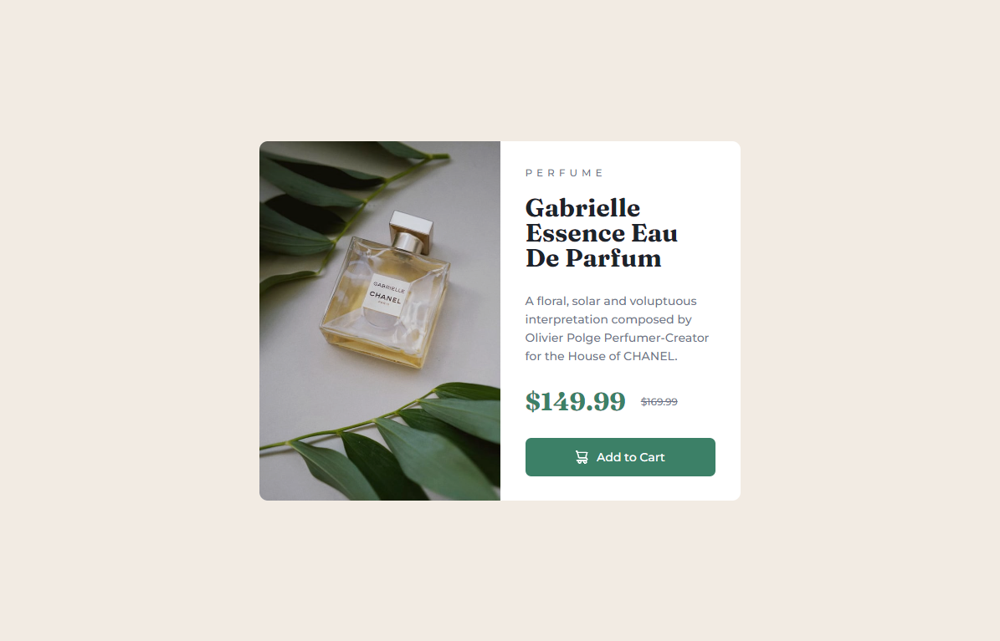

# Frontend Mentor - Product preview card component solution

This is a solution to the [Product preview card component challenge on Frontend Mentor](https://www.frontendmentor.io/challenges/product-preview-card-component-GO7UmttRfa). Frontend Mentor challenges help you improve your coding skills by building realistic projects. 

## Table of contents

- [Overview](#overview)
  - [The challenge](#the-challenge)
  - [Screenshot](#screenshot)
  - [Links](#links)
- [My process](#my-process)
  - [Built with](#built-with)
  - [What I learned](#what-i-learned)
  - [Continued development](#continued-development)
- [Author](#author)

## Overview

### The challenge

Users should be able to:

- View the optimal layout depending on their device's screen size
- See hover and focus states for interactive elements

### Screenshot

### Links

- Solution URL: [https://www.frontendmentor.io/solutions/solution-using-flexbox-media-queries-filter-display-none-QsJsrDnIU_](https://www.frontendmentor.io/solutions/solution-using-flexbox-media-queries-filter-display-none-QsJsrDnIU_)
- Live Site URL: [https://rock-n-roll-crc.github.io/product-preview-card-component/](https://rock-n-roll-crc.github.io/product-preview-card-component/)

## My process

### Built with

- Flexbox
- Media queries
- filter property
- display: none

### What I learned

While working on this challenge I consolidated my knowledge of working with images, media queries. I learnt about filter property and how to properly use it with images. 

### Continued development

In my future projects I want to learn more about filter property and improve my skills with CSS Grid...

## Author

- Frontend Mentor - [Rock_n_Roll_CRC](https://www.frontendmentor.io/profile/Rock-n-Roll-CRC)
- Twitter - [@Rock_n_Roll_CRC](https://twitter.com/Rock_n_Roll_CRC)